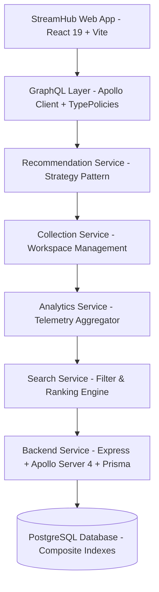

# StreamHub

> Production-ready, high-performance **Content Intelligence & Discovery Platform** built with React 19, Vite, TypeScript, Express, Apollo Server (GraphQL), Prisma ORM, and PostgreSQL.

[](https://github.com/Sarath-Patti/StreamHub/actions/workflows/ci.yml)
[](CHANGELOG.md)
[](LICENSE)

---

## Overview

**StreamHub** is a production-grade **Content Intelligence Platform** designed to solve the challenges of modern discovery, explainable recommendations, user workspace collections, and real-time telemetry analytics.

Unlike standard streaming clones or basic video catalogue prototypes, StreamHub emphasizes software engineering rigor, clean decoupled service architecture, strategy-driven scoring algorithms, and transparent decision explainability.

---

## Why StreamHub?

Modern discovery applications often rely on opaque black-box recommendations or heavy external search infrastructure. StreamHub demonstrates how a lightweight, deterministic, and explainable intelligence engine can be engineered cleanly using TypeScript, React 19, GraphQL, and design patterns:

- **Explainability**: Every recommendation score and search result exposes transparent, human-readable match explanations out of 100 points.
- **Pluggability**: Recommendation algorithms follow the Strategy Pattern (`RecommendationStrategy`) and register dynamically into a runtime registry (`RecommendationRegistry`).
- **Decoupled Architecture**: Zero business or scoring calculations live inside React components. All logic is isolated in dedicated service modules.
- **Production Rigor**: Fully equipped with centralized logging, performance timing, route code-splitting, WCAG accessibility, and comprehensive automated test suites.

---

## Core Features

- 🔎 **Discover Experience**: Authenticated content discovery workspace with Trending, Popular, Top Rated, and Recently Released carousels, genre filtering chips, deep-linking URL parameters (`?q=`), and pagination.
- 🎯 **Explainable Recommendation Engine**: 100-point transparent match scoring breakdown across 5 dimensions (Genre Similarity 40, Rating Weight 25, Popularity 15, Recency 10, Diversity 10).
- 🧩 **Pluggable Strategy Selector**: Instant algorithm switching (`Hybrid`, `Genre Similarity`, `Trending`, `Hidden Gems`, `Critics' Choice`) without page refreshes.
- 📊 **Algorithm Comparator**: Side-by-side strategy score comparison tool evaluating content candidates against all registered algorithms.
- 📚 **Personal Collections Workspace**: Custom collection management (`/collections`, `/collections/:id`) with inline collection creation, search filtering, and GraphQL watchlist synchronization.
- 📊 **Analytics & Insights Dashboard**: Real-time telemetry (`/analytics`) visualizing collection statistics, genre distribution, format breakdown, and activity audit logs.
- 🔍 **Search Intelligence & Personal Discovery**: Deterministic 0–100 Search Score ranking engine (`/search`), multi-criteria filters (7 parameters), saved searches, search history, and intelligent discovery presets.
- ⚡ **Production Engineering**: Structured logging (`Logger`), latency profiling (`PerformanceService`), route code-splitting (`React.lazy`), and WCAG accessibility.

---

## Engineering Highlights

- **Strategy Pattern**: Pluggable evaluation algorithms implementing `RecommendationStrategy`.
- **Registry Pattern**: Runtime strategy registration via `RecommendationRegistry`.
- **Decoupled Service Layer**: Isolated domain services (`SearchService`, `AnalyticsService`, `RecommendationService`, `CollectionService`).
- **Analytics Telemetry Pipeline**: Real-time aggregation of workspace activity, genre distribution, and format breakdown.
- **Search Intelligence Pipeline**: Multi-criteria `SearchFilterEngine` $\rightarrow$ deterministic `SearchRankingEngine` $\rightarrow$ `SearchHistoryService`.
- **Recommendation Pipeline**: Strategy selection $\rightarrow$ Candidate evaluation $\rightarrow$ Score calculation $\rightarrow$ Explanation generation.
- **Centralized Configuration**: Environment-aware configuration modules (`src/config/`).
- **Performance Monitoring**: Native latency profiling with `PerformanceService`.
- **Structured Logging**: Environment-filtered `Logger` (`DEBUG`, `INFO`, `WARN`, `ERROR`).
- **Testing**: 67 automated unit and integration tests across frontend and backend.
- **Accessibility**: WCAG compliance (`role="dialog"`, `aria-modal="true"`, keyboard `Escape` closing).

---

## System Architecture

StreamHub isolates search intelligence, analytics telemetry, recommendation strategy evaluation, and workspace collections into modular service layers:



### Architecture Layer Descriptions
1. **Frontend Presentation**: Pure React 19 UI components using Tailwind CSS and custom hooks.
2. **GraphQL Layer**: Apollo Client managing client-side caching, typePolicies, and authorization links.
3. **Recommendation Engine**: Strategy Pattern engine computing transparent scores out of 100 points.
4. **Collection Workspace Service**: Handles user collection CRUD, local storage fallback, and GraphQL sync.
5. **Analytics Telemetry Service**: Aggregates collection dynamics, format breakdown, and audit activity.
6. **Search Intelligence Service**: Executes 7-criteria filtering and 0–100 match ranking.
7. **Backend Service**: Express + Apollo Server 4 server using Prisma ORM and PostgreSQL with composite database indexes.

---

## Technology Stack

| Domain | Technology / Tooling |
| ------ | -------------------- |
| **Frontend Core** | React 19, Vite, TypeScript, Tailwind CSS, React Router v6 |
| **State & Data** | Apollo Client 3.10, TypePolicies, Custom React Hooks |
| **Backend Core** | Node.js, Express, Apollo Server 4, Prisma ORM, PostgreSQL |
| **Services & Architecture** | Strategy Pattern, Registry Pattern, Service Layer, Pipeline Architecture |
| **Quality & Tooling** | Vitest, ESLint, TypeScript, Pino Logging, Docker Compose |

---

## Repository Structure

```
StreamHub/
├── .github/
│   ├── ISSUE_TEMPLATE/       # Bug report and feature request templates
│   ├── PULL_REQUEST_TEMPLATE.md
│   └── workflows/ci.yml      # CI workflow for linting, building, and testing
├── backend/
│   ├── prisma/               # Schema and seed scripts
│   ├── src/                  # Express + Apollo Server 4 backend
│   └── package.json
├── docs/                     # Engineering & architectural documentation
│   ├── Architecture.md
│   ├── DeveloperGuide.md
│   ├── EngineeringPatterns.md
│   ├── FolderStructure.md
│   ├── ReleaseChecklist.md
│   └── ReleaseNotes-v2.0.0.md
├── frontend/
│   ├── src/                  # React 19 frontend
│   │   ├── components/       # Domain UI components
│   │   ├── config/           # Centralized configuration
│   │   ├── graphql/          # Operations and client setup
│   │   ├── hooks/            # Custom React hooks
│   │   ├── pages/            # Lazy-loaded route pages
│   │   ├── services/         # Service layer (analytics, collection, logger, search, recommendation)
│   │   └── App.tsx           # Main router with code-splitting
│   └── package.json
├── CHANGELOG.md
├── CODE_OF_CONDUCT.md
├── CONTRIBUTING.md
├── docker-compose.yml
├── LICENSE
├── README.md
└── SECURITY.md
```

---

## Getting Started

### One-Command Docker Startup (Recommended)

```bash
git clone https://github.com/Sarath-Patti/StreamHub.git
cd StreamHub
docker compose up --build
```

Open your browser at **http://localhost:3000**

- **Frontend App**: http://localhost:3000
- **GraphQL Endpoint**: http://localhost:4000/graphql
- **Health Check**: http://localhost:4000/api/health
- **Readiness Check**: http://localhost:4000/api/ready

---

### Local Development (Without Docker)

1. **Start PostgreSQL**: Ensure PostgreSQL is running on port `5432` with database `streamhub`.
2. **Setup Database**:
   ```bash
   cd backend
   npx prisma db push
   npx prisma db seed
   ```
3. **Run Application**:
   ```bash
   # From root directory
   npm run dev
   ```

### Monorepo Scripts (Root)

```bash
npm run dev        # Starts Frontend & Backend concurrently
npm run build      # Builds Backend & Frontend
npm run test       # Runs Backend & Frontend test suites
npm run lint       # Lints Backend & Frontend code
npm run docker     # Runs docker compose up --build
npm run clean      # Cleans node_modules and build artifacts
```

---

## Developer Documentation

Detailed architectural and developer guides are available under `docs/`:

- 📐 [docs/Architecture.md](docs/Architecture.md) — System layers and communication flows.
- 🚀 [docs/DeveloperGuide.md](docs/DeveloperGuide.md) — Local setup, testing, and developer conventions.
- 🧠 [docs/EngineeringPatterns.md](docs/EngineeringPatterns.md) — Strategy, Registry, Service Layer, and Pipeline design patterns.
- 📁 [docs/FolderStructure.md](docs/FolderStructure.md) — Directory organization and module responsibilities.
- 📜 [docs/ReleaseNotes-v2.0.0.md](docs/ReleaseNotes-v2.0.0.md) — Release notes for v2.0.0 production release.
- ✅ [docs/ReleaseChecklist.md](docs/ReleaseChecklist.md) — Release readiness checklist.

---

## Roadmap

- [x] **v1.0.0** — Monolithic Backend, Security Hardening, Database Indexing & Operational Readiness
- [x] **v1.0.1** — One-Command Docker Startup & Developer Experience Update
- [x] **v1.1.0** — Frontend Architecture Foundation (React 19 + Vite + Tailwind + Apollo Client)
- [x] **v1.2.0** — Discover Experience & Deep-linked Filtering
- [x] **v1.2.1** — Seed Data Expansion (40 catalog items across 10 genres)
- [x] **v1.3.0** — Content Intelligence Page (`/content/:id`)
- [x] **v1.4.0** — Explainable Recommendation Engine & Strategy Registry
- [x] **v1.5.0** — Personal Collections & Discovery Workspace (`/collections`)
- [x] **v1.6.0** — Analytics & Insights Dashboard (`/analytics`)
- [x] **v1.7.0** — Search Intelligence & Personal Discovery (`/search`)
- [x] **v1.8.0** — Production Engineering & Developer Experience
- [x] **v2.0.0** — Production Open-Source Release

---

## Future Improvements

- 📸 **Visual Documentation**: High-resolution screenshots and GIF demonstrations in `./docs/screenshots/`.
- ☁️ **Cloud Deployment**: Helm chart manifests and Infrastructure-as-Code for Kubernetes deployment.
- ⚡ **Backend Engine Upgrades**: Vector embeddings integration for hybrid similarity calculations.

---

## License

[MIT](LICENSE) © 2026 Sarath Patti
